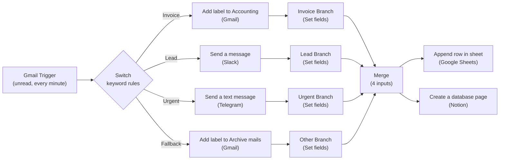

# 📧 Smart Email Router (n8n)

An n8n workflow that watches a Gmail inbox, automatically **classifies
incoming emails** (Urgent / Invoice / Lead / Other) using keyword rules
(English + Serbian), routes each category to the right notification channel,
labels the email in Gmail, and logs every email into both a **Google Sheet**
and a **Notion database** for record-keeping.

## 🧠 How it works

1. **Gmail Trigger** polls the inbox every minute for unread messages.
2. A **Switch** node classifies each email by matching subject/body/snippet
   text against keyword patterns (bilingual EN/SR) into 4 branches:
   - **Urgent** — words like "urgent", "asap", "hitno", "odmah"
   - **Invoice** — words like "invoice", "faktura", "račun", "payment due"
   - **Lead** — words like "lead", "upit", "ponuda", "inquiry", "demo"
   - **Fallback (Other)** — anything that doesn't match the above
3. Each branch triggers a different action:
   - **Urgent** → sends a **Telegram alert**
   - **Invoice** → adds a Gmail **label** ("Accounting")
   - **Lead** → sends a **Slack message** to a teammate
   - **Other** → adds a Gmail **label** ("Archive")
4. Each branch then sets a normalized **category record** (sender, subject,
   received time, category) via a `Set` node.
5. All four branches converge into a **Merge** node.
6. The merged record is written to a **Google Sheet** and a **Notion
   database** in parallel, giving a searchable log of every processed email.

## 🗺️ Architecture diagram

## ⚙️ Nodes used

| Node | Type | Role |
|---|---|---|
| Gmail Trigger | `n8n-nodes-base.gmailTrigger` | Polls inbox for unread mail every minute |
| Switch | `n8n-nodes-base.switch` | Classifies email into Urgent / Invoice / Lead / Other |
| Send a text message | `n8n-nodes-base.telegram` | Sends a Telegram alert for urgent emails |
| Add label to Accounting | `n8n-nodes-base.gmail` | Labels invoice emails in Gmail |
| Send a message | `n8n-nodes-base.slack` | Notifies a teammate on Slack about new leads |
| Add label to Archive mails | `n8n-nodes-base.gmail` | Labels everything else for archiving |
| Urgent / Invoice / Lead / Other Branch | `n8n-nodes-base.set` | Normalizes each email into a common record shape |
| Merge | `n8n-nodes-base.merge` | Combines all 4 branches back into one stream |
| Append row in sheet | `n8n-nodes-base.googleSheets` | Logs the email record to a spreadsheet |
| Create a database page | `n8n-nodes-base.notion` | Logs the email record to a Notion database |

## 🔑 Required credentials

Create these yourself in your own n8n instance — none are included in this
repo:

| Service | Credential type in n8n | Where to get it |
|---|---|---|
| Gmail | `gmailOAuth2` | [Google Cloud Console](https://console.cloud.google.com/) OAuth2 client |
| Slack | `slackApi` | [Slack API apps](https://api.slack.com/apps) |
| Telegram Bot | `telegramApi` | [@BotFather](https://t.me/BotFather) on Telegram |
| Google Sheets | `googleSheetsOAuth2Api` | Google Cloud Console OAuth2 client |
| Notion | `notionApi` | [Notion integrations](https://www.notion.so/my-integrations) |

## 🚀 Setup

1. Import `Smart_Email_Router.json` into your n8n instance
   (**Workflows → Import from File**).
2. Create the five credentials listed above and attach them to the matching
   nodes: `Gmail Trigger`, `Add label to Accounting`, `Add label to Archive
   mails` → Gmail; `Send a message` → Slack; `Send a text message` →
   Telegram; `Append row in sheet` → Google Sheets; `Create a database page`
   → Notion.
3. In **Send a message** (Slack), set `user` to the Slack member you want to
   notify about leads.
4. In **Send a text message** (Telegram), set `chatId` to your own Telegram
   chat ID (message [@userinfobot](https://t.me/userinfobot) to find yours).
5. In **Add label to Accounting** / **Add label to Archive mails**, replace
   the placeholder `labelIds` with real Gmail label IDs from your own account
   (**Gmail → Settings → Labels**, or use n8n's label picker).
6. In **Append row in sheet**, point `documentId`/`sheetName` at your own
   Google Sheet (with columns: Sender, Subject, Received Time, Category).
7. In **Create a database page**, point `databaseId` at your own Notion
   database (with matching properties: Sender, Subject, Date, Category).
8. Adjust the keyword lists in the **Switch** node's conditions if you want
   different categories or languages.
9. Activate the workflow.

## ⚠️ Security notes

Before publishing, this workflow JSON had the following removed/replaced
with placeholders:
- All credential IDs (Gmail, Slack, Telegram, Google Sheets, Notion)
- Internal n8n webhook IDs
- A real Slack user's ID and username (was hardcoded as the Lead notification
  recipient)
- A real Telegram chat ID
- Real Gmail label IDs
- The real Google Sheet ID/URL and Notion database ID/URL

No actual API keys were present in the export — n8n stores those encrypted
server-side, not in the workflow JSON — but the identifiers above were
scrubbed as good practice. The workflow is also set to `"active": false` by
default.

## 📌 Possible improvements

- Add a "Meeting request" or "Support" category if your inbox needs it.
- Use an LLM node instead of keyword regex for smarter classification of
  ambiguous emails.
- Add error handling/retry logic around the Slack/Telegram notification
  nodes (currently set to "continue on error" so one failed notification
  doesn't block the rest of the flow).

## 📝 License

MIT — feel free to reuse and adapt.
